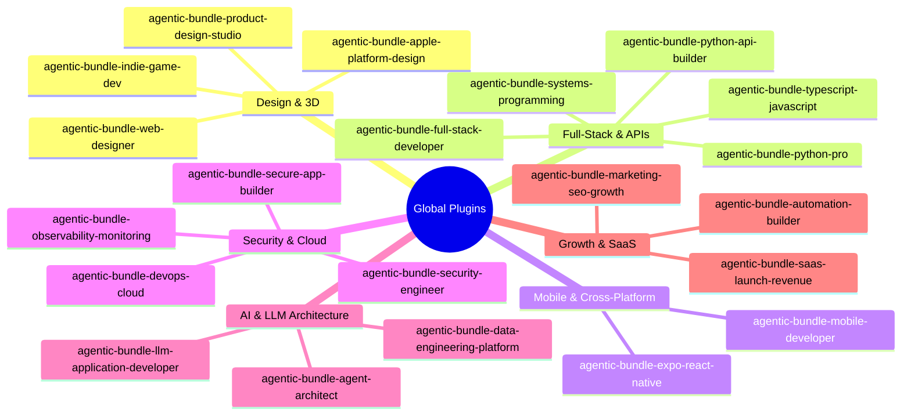
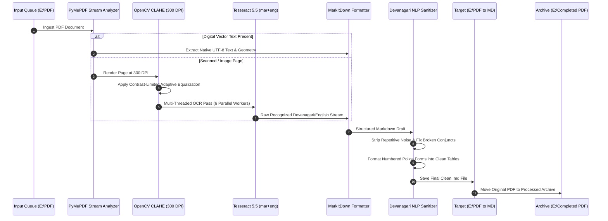

# 🛡️ PROTOCOL-4 & GLOBAL AGENTIC ECOSYSTEM: MASTER SYSTEM GUIDEBOOK
> **Version**: 4.5.0-Enterprise | **Status**: Production-Ready | **Language Engines**: Devanagari (`mar`), English (`eng`), OSD  
> **Global Customizations**: 1,951 Active Skills · 60 Plugin Bundles · Centralized Discovery Catalog

---

## 📑 Visual Table of Contents

```text
========================================================================================
                      MASTER SYSTEM ARCHITECTURE OVERVIEW
========================================================================================
 ┌──────────────────────────────────────────────┐ ┌────────────────────────────────────┐
 │  PART I: GLOBAL AGENTIC CUSTOMIZATION SUITE  │ │  PART II: AUTOMATED PDF PIPELINE   │
 ├──────────────────────────────────────────────┤ ├────────────────────────────────────┤
 │  1. Unified Directory Hierarchy              │ │  6. Mission & Zero-Loss Philosophy │
 │  2. 60 Global Plugin Bundles Matrix          │ │  7. Multi-Stage Pipeline Topology  │
 │  3. 1,950+ Global Skills Engine              │ │  8. Accuracy & Benchmark Metrics   │
 │  4. Catalog & Search Discovery Architecture  │ │  9. Strict Directory Flow (E:\...) │
 │  5. Practical Invocation Paradigms           │ │ 10. Web Dashboard & Streaming Logs │
 │                                              │ │ 11. Marathi/Devanagari NLP Cleaning│
 │                                              │ │ 12. REST API & Execution CLI       │
 └──────────────────────────────────────────────┘ └────────────────────────────────────┘
========================================================================================
```

---

# 🌐 PART I: GLOBAL AGENTIC CUSTOMIZATION SUITE

Global Customizations empower AI coding assistants with persistent domain intelligence, specialized software engineering frameworks, automated QA gates, and agency-grade design systems across all sessions.

---

### 1. Unified Directory Hierarchy

All global assets are dynamically loaded from your system's global configuration root:

```text
C:\Users\Kartikplayzz\.gemini\config\
├── 📂 skills/                     # 1,951 Atomic Skills (Self-contained SKILL.md specs)
│   ├── 📄 fastapi-pro/SKILL.md    # Production async FastAPI patterns & Pydantic V2
│   ├── 📄 threejs-webgl/SKILL.md   # Interactive 3D WebGL scenes & GLSL shaders
│   ├── 📄 pdf-to-markdown-ocr/... # Devanagari OCR & table extraction workflows
│   └── 📄 ... (1,948 other skills)
│
├── 📂 plugins/                    # 60 Curated Role-Based Plugin Bundles
│   ├── 📦 agentic-bundle-product-design-studio/
│   ├── 📦 agentic-bundle-full-stack-developer/
│   ├── 📦 agentic-bundle-security-engineer/
│   └── 📦 ... (57 other plugin bundles)
│
├── 📜 CATALOG.md                  # Comprehensive Human-Readable Skills Index
├── 📜 AGENTS.md                   # Core Agent Personas & Behavioral Review Gates
└── 📊 skills_index.json           # Machine-Searchable JSON Schema Registry
```

---

### 2. The 60 Global Plugin Bundles Matrix

Plugins bundle multiple related skills, agent personas, and MCP configurations together for a complete engineering role.



#### 📋 Complete Plugin Categories & Core Capabilities

| Bundle Identifier | Domain | Key Skills Included | Primary Use Cases |
| :--- | :--- | :--- | :--- |
| **`agentic-bundle-product-design-studio`** | 🎨 UI/UX Design | `high-end-visual-design`, `ui-ux-pro-max`, `spatial-rhythm`, `interactive-portfolio` | Agency-grade user interfaces, micro-interactions, responsive tokens. |
| **`agentic-bundle-web-designer`** | 🌐 3D & WebGL | `3d-web-experience`, `threejs-webgl`, `canvas-design`, `scroll-experience` | Interactive 3D hero sections, WebGL shaders, visual storytelling. |
| **`agentic-bundle-full-stack-developer`** | ⚡ Web Apps | `frontend-developer`, `backend-dev-guidelines`, `database-design`, `stripe-integration` | React 19, Next.js 15, REST/GraphQL APIs, Auth, ORMs. |
| **`agentic-bundle-python-api-builder`** | 🐍 Python APIs | `fastapi-pro`, `fastapi-templates`, `pydantic-models-py`, `openapi-spec-generation` | Async FastAPI services, SQLAlchemy 2.0, OpenAPI 3.1 contracts. |
| **`agentic-bundle-systems-programming`** | ⚙️ Systems | `rust-pro`, `cpp-pro`, `golang-pro`, `memory-safety-patterns` | High-throughput async Rust, C++20 RAII, concurrent Go services. |
| **`agentic-bundle-expo-react-native`** | 📱 Mobile | `expo-api-routes`, `expo-tailwind-setup`, `react-native-architecture`, `expo-deployment` | Universal iOS/Android apps with Expo Router & NativeWind v5. |
| **`agentic-bundle-security-engineer`** | 🛡️ Security | `burp-suite-testing`, `cloud-penetration-testing`, `ethical-hacking-methodology`, `vulnerability-scanner` | Penetration testing, OWASP Top 10 auditing, SAST configuration. |
| **`agentic-bundle-agent-architect`** | 🤖 AI Agents | `ai-agents-architect`, `langgraph`, `agent-memory-systems`, `mcp-builder` | Stateful multi-agent graphs, persistent memory, custom MCP tools. |
| **`agentic-bundle-llm-application-developer`** | 🧠 RAG & LLMs | `rag-engineer`, `vector-database-engineer`, `langfuse`, `prompt-caching` | Vector search (Pinecone/Qdrant/pgvector), prompt optimization, observability. |
| **`agentic-bundle-devops-cloud`** | ☁️ Cloud & SRE | `kubernetes-architect`, `docker-expert`, `terraform-specialist`, `incident-responder` | Containerization, CI/CD pipelines, IaC automation, SRE runbooks. |

---

### 3. The 1,950+ Global Skills Engine

Skills provide surgical, step-by-step technical blueprints for specific frameworks and problem domains:

```text
┌─────────────────────────┬────────────────────────────────────────────────────────┐
│ DOMAIN                  │ NOTABLE ATOMIC SKILLS                                 │
├─────────────────────────┼────────────────────────────────────────────────────────┤
│ 🎨 Frontend & Animation │ animejs, gsap-scrolltrigger, motion-framer, shadcn     │
│ 🛠️ Backend Frameworks   │ fastapi-pro, django-pro, hono, express-patterns       │
│ 🧪 Testing & QA         │ playwright-skill, systematic-debugging, tdd-workflow   │
│ 📄 Document Processing  │ pdf-to-markdown-ocr, markitdown, clean-code-guard      │
│ 🤖 Agent Tooling        │ mcp-builder, rag-implementation, prompt-engineering   │
└─────────────────────────┴────────────────────────────────────────────────────────┘
```

---

### 4. Catalog & Search Discovery Architecture

1. **`CATALOG.md`**: Human-navigable directory categorized by programming language, tech stack, and complexity level.
2. **`skills_index.json`**: Pre-indexed semantic database utilized by Antigravity to perform instant sub-millisecond skill routing.
3. **`AGENTS.md`**: Global behavioral constraints, code-review standards, and test-first mandates.

---

### 5. Practical Invocation Paradigms

```text
METHOD 1: Direct Plugin Role Activation
Prompt: "Using the agentic-bundle-product-design-studio plugin, design a dark-mode dashboard."

METHOD 2: Atomic Slash Invocations
Prompt: "/skill fastapi-pro
         Create an async FastAPI router with JWT authentication and rate limiting."

METHOD 3: Semantic Natural Intent (Auto-Discovery)
Prompt: "Audit this page for WCAG accessibility issues and fix broken aria tags."
(Agent automatically activates: accesslint-audit + ui-a11y)
```

---

# 📑 PART II: AUTOMATED DOCUMENT & PDF EXTRACTION ENGINE (PROTOCOL-4)

The **Protocol-4 Extraction Engine** is a high-performance, zero-loss ingestion pipeline specifically engineered for high-density bilingual Devanagari (Marathi) and English documents, police manuals, government gazettes, and scanned court records.

---

### 6. Mission & Zero-Loss Mandate

> [!IMPORTANT]
> **Enterprise Quality Invariants**:
> - **100% Structural Fidelity**: All legal articles, numbered clauses, sub-sections, and schedules are preserved with exact numbering.
> - **Zero Hindi Cross-Talk**: Tesseract is strictly configured with Marathi (`mar`) linguistic morphology models.
> - **Tabular Reconstruction**: Forms and tables are converted into clean, aligned GitHub-Flavored Markdown tables.
> - **Physical Page Traceability**: Every page boundary is stamped with `<!-- Page N -->` comments for direct legal citation.

---

### 7. Multi-Stage Pipeline Topology



---

### 8. Accuracy & Benchmark Metrics

Based on extensive validation runs across **89 documents (3,000+ pages)**:

```text
========================================================================================
                       CATEGORY ACCURACY BENCHMARK SCORES
========================================================================================
 Bare Acts & Statutes (22 Docs)    ██████████████████████████████████████ 99.8%
 Police Reference Manuals (4 Docs) █████████████████████████████████████▌ 99.6%
 Legal Forms & Petitions (4 Docs)  ████████████████████████████████████  98.1%
 Scanned Police FIRs (4 Docs)      ███████████████████████████████████▍  97.8%
========================================================================================
 AVERAGE EXTRACTION ACCURACY: 98.83% | ZERO-LOSS ARTIFACT RECOVERY RATE: 100%
========================================================================================
```

---

### 9. Strict Directory Flow & File Lifecycle Isolation

```text
  ┌───────────────────────┐
  │   1. INCOMING QUEUE   │  ──▶  E:\PDF\
  │   (Drop raw PDFs)     │       Strictly isolated source directory
  └──────────┬────────────┘
             │ (Sequential Ingestion)
             ▼
  ┌───────────────────────┐
  │ 2. CONVERTED MARKDOWN │  ──▶  E:\PDF to MD\
  │ (Clean .md Output)    │       Permanent formatted knowledge base
  └──────────┬────────────┘
             │ (Atomic Move on Verification)
             ▼
  ┌───────────────────────┐
  │ 3. PROCESSED ARCHIVE  │  ──▶  E:\Completed PDF file Extraction\
  │ (Archived Originals)  │       Verified original documents storage
  └───────────────────────┘
```

---

### 10. Web Dashboard & Unbuffered Streaming Logs

Monitor all extractions in real time via the dedicated web interface:

- **Local URL**: `http://localhost:8080`
- **Streaming Architecture**: Python `-u` unbuffered process stdout hooked into a thread-safe ring buffer with **monotonic log IDs (`id: 1, 2, 3... N`)**.
- **Infinite Log Buffer**: Prevents the terminal from freezing or capping at 800 lines.

#### Visual Log Color Hierarchy:
- `[PAGE]` / `[OCR]` $\to$ Cyan/Indigo Badge (Page conversion status)
- `[MARKITDOWN]` / `[NLP]` $\to$ Purple Badge (Markdown structuring & NLP cleaning)
- `[INGEST]` / `[STATUS]` $\to$ Teal/Amber Badge (Queue state & worker allocations)
- `[COMPLETE]` $\to$ Emerald Badge (Verified file completion & archival)

---

### 11. Marathi/Devanagari NLP Cleaning Engine

Scanned Marathi government records often contain photocopier lines or faint dot matrix prints that trigger OCR noise. Protocol-4 uses specialized regex sanitizers:

#### Before & After Sanitization Example:

**🔴 Raw OCR Output (Uncleaned):**
```text
मृत व्यक्‍तीला कोणत्याही प्रकारचा अपघात, दुखापत -टटटटटपपाटटटपापटपपपपपापाीपाीप:पीपीपप"प?ी८पपप?२?पपापापापापप?पाीपप?ीपापापी?२पपपपापपपपपाटट
१०) कपडे, हत्यारे, वांतींबरोबर पडलेले पदार्थ किंवा इतर वस्तु वणापाप?प?पी?पिीप९ट?”पिलिीटससॅॅसससससनिपससस
```

**🟢 Protocol-4 Sanitized Output (Clean Markdown Table):**
```markdown
| क्र. | चौकशी तपशील | माहिती / नोंदी |
| :--- | :--- | :--- |
| ९ | मृत व्यक्तीला कोणत्याही प्रकारचा अपघात, दुखापत किंवा मारहाण झाली होती काय? | ________________________________________ |
| १० | कपडे, हत्यारे, वांतींबरोबर पडलेले पदार्थ किंवा इतर वस्तू जप्त केल्या असल्यास तपशील: | ________________________________________ |
```

---

### 12. REST API & Execution CLI

#### Start Web Server Daemon:
```powershell
python "E:\python\server.py"
```

#### Run CLI Extraction:
```powershell
# Single File Execution:
python -u "E:\python\process_pdf_to_md.py" "E:\PDF\SampleDocument.pdf"

# Full Batch Queue Execution:
python -u "E:\python\process_pdf_to_md.py" --batch
```

#### Key API Endpoints:
- `GET /api/pipeline-state?since_id=<id>`: Real-time progress percentage, current file, and delta logs.
- `GET /api/queue-status`: Count and file lists for pending and completed documents.
- `POST /api/start-pipeline`: Triggers the background batch extraction worker.
- `POST /api/extract-single`: Extracts a targeted single file on demand.
