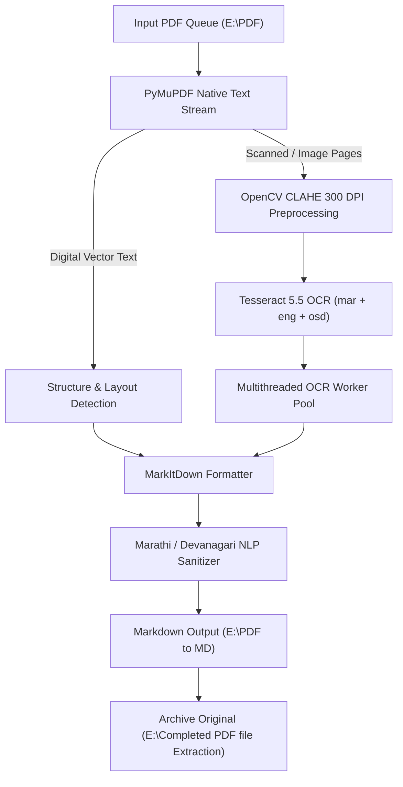

# 📖 Master System Guidebook: Global Plugins, Skills, Catalog & PDF Extraction Pipeline

---

## 📑 Table of Contents
1. [Part I: Global Customizations Architecture](#part-i-global-customizations-architecture)
   - [1.1 Directory Hierarchy & Locations](#11-directory-hierarchy--locations)
   - [1.2 Global Plugins: Complete Domain Bundles](#12-global-plugins-complete-domain-bundles)
   - [1.3 Global Skills: 1,950+ Skills Library & Invocation](#13-global-skills-1950-skills-library--invocation)
   - [1.4 System Catalog & Index (`CATALOG.md` & `skills_index.json`)](#14-system-catalog--index-catalogmd--skills_indexjson)
   - [1.5 How to Call Plugins & Skills (3 Proven Methods)](#15-how-to-call-plugins--skills-3-proven-methods)
2. [Part II: Automated PDF "Extraction Pipeline" (Protocol-4)](#part-ii-automated-pdf-extraction-pipeline-protocol-4)
   - [2.1 Pipeline Overview & Engine Architecture](#21-pipeline-overview--engine-architecture)
   - [2.2 Directory Routing & File Lifecycles](#22-directory-routing--file-lifecycles)
   - [2.3 Live Web Dashboard & Unbuffered Terminal Stream](#23-live-web-dashboard--unbuffered-terminal-stream)
   - [2.4 API Endpoints Reference](#24-api-endpoints-reference)
   - [2.5 Execution Guide: CLI & Automated Processing](#25-execution-guide-cli--automated-processing)
   - [2.6 Devanagari / Marathi NLP Sanitization Specs](#26-devanagari--marathi-nlp-sanitization-specs)

---

# Part I: Global Customizations Architecture

Global Customizations give AI coding agents persistent capabilities, domain knowledge, design systems, and specialized toolkits across all sessions.

---

### 1.1 Directory Hierarchy & Locations

All global configurations are automatically discovered and loaded from your user root:

```text
C:\Users\Kartikplayzz\.gemini\config\
├── skills/                     # 1,951 Individual Skills (Atomic Guides & Workflows)
│   ├── fastapi-pro/
│   │   └── SKILL.md
│   ├── threejs-webgl/
│   │   └── SKILL.md
│   └── ...
├── plugins/                    # 60 Full-Stack Plugin Bundles (Role-Based Environments)
│   ├── agentic-bundle-product-design-studio/
│   ├── agentic-bundle-full-stack-developer/
│   ├── agentic-bundle-security-engineer/
│   └── ...
├── CATALOG.md                  # Comprehensive Human-Readable Skills Directory
├── AGENTS.md                   # Agent Persona & Behavioral Rules
└── skills_index.json           # Machine-Searchable JSON Skill Registry
```

---

### 1.2 Global Plugins: Complete Domain Bundles

A **Plugin** groups multiple related skills, agent personas, and MCP configurations together for a complete engineering role.

#### 🎨 1. Design, UI/UX & Creative Engineering
| Plugin Name | Primary Focus & Included Capabilities |
| :--- | :--- |
| `agentic-bundle-product-design-studio` | Agency-grade visual UI/UX, micro-interactions, responsive design systems, spatial layouts. |
| `agentic-bundle-web-designer` | WebGL, Three.js 3D experiences, Canvas generative art, cinematic scroll storytelling. |
| `agentic-bundle-apple-platform-design` | Apple Human Interface Guidelines (HIG), iOS 18/macOS widgets, Live Activities. |
| `agentic-bundle-indie-game-dev` | 2D/3D Game development, Godot 4 GDScript, Unity 6, game physics & audio. |

#### ⚡ 2. Full-Stack, Web & Mobile Development
| Plugin Name | Primary Focus & Included Capabilities |
| :--- | :--- |
| `agentic-bundle-full-stack-developer` | Full-stack architecture, React 19, Next.js 15 App Router, REST/tRPC APIs, Prisma/SQL. |
| `agentic-bundle-typescript-javascript` | Advanced TypeScript typing, Node.js performance, monorepo architectures. |
| `agentic-bundle-python-pro` | Python 3.12+, async programming, uv/ruff workflows, Celery, pytest best practices. |
| `agentic-bundle-python-api-builder` | High-performance FastAPI, SQLAlchemy 2.0, Pydantic V2, OpenAPI 3.1 auto-generation. |
| `agentic-bundle-systems-programming` | Rust 1.75+ async patterns, C++20 RAII, Go 1.21+ goroutine/channel patterns. |
| `agentic-bundle-expo-react-native` | React Native Expo Router, NativeWind v5 universal styling, EAS Cloud deployment. |
| `agentic-bundle-mobile-developer` | Swift/SwiftUI iOS applications, Flutter/Dart 3, offline-first mobile sync. |

#### 🛡️ 3. Security, DevSecOps & Cloud Infrastructure
| Plugin Name | Primary Focus & Included Capabilities |
| :--- | :--- |
| `agentic-bundle-security-engineer` | Penetration testing, ethical hacking, OWASP Top 10 web vulnerabilities, Burp Suite. |
| `agentic-bundle-secure-app-builder` | Secure authentication (OAuth2/JWT), backend/frontend sanitization, SAST scanners. |
| `agentic-bundle-devops-cloud` | Kubernetes cluster architecture, Docker multi-stage containers, Terraform/OpenTofu, CI/CD. |
| `agentic-bundle-observability-monitoring`| Distributed tracing (Jaeger/Tempo), Prometheus/Grafana dashboards, SRE incident response. |

#### 🤖 4. AI Agents, LLMs & Data Engineering
| Plugin Name | Primary Focus & Included Capabilities |
| :--- | :--- |
| `agentic-bundle-agent-architect` | Multi-agent orchestration, LangGraph stateful graph loops, ReAct agents, MCP servers. |
| `agentic-bundle-llm-application-developer` | RAG systems, Pinecone/Qdrant/pgvector, prompt caching, Langfuse observability. |
| `agentic-bundle-data-engineering-platform`| Apache Airflow DAGs, dbt transformations, data quality contracts (Great Expectations). |
| `agentic-bundle-data-analytics` | SQL analytics, KPI dashboards, A/B testing frameworks, data storytelling. |

#### 💼 5. SaaS Launch, Marketing & Automation
| Plugin Name | Primary Focus & Included Capabilities |
| :--- | :--- |
| `agentic-bundle-saas-launch-revenue` | Stripe billing & subscriptions, micro-SaaS MVPs, pricing strategies, churn prevention. |
| `agentic-bundle-marketing-seo-growth` | Programmatic SEO, schema.org structured data, high-converting copywriting. |
| `agentic-bundle-automation-builder` | Multi-app workflows with Slack, Airtable, Notion, Make, and n8n integrations. |

---

### 1.3 Global Skills: 1,950+ Skills Library & Invocation

A **Skill** is an atomic instruction manual (`SKILL.md`) dedicated to a specific technology or technique.

#### Common High-Impact Skills:
- **Web Design & Animation**: `threejs-webgl`, `animejs`, `gsap-scrolltrigger`, `motion-framer`, `lottie-animations`, `ui-ux-pro-max`, `shadcn`.
- **Backend & APIs**: `fastapi-pro`, `django-pro`, `api-endpoint-builder`, `auth-implementation-patterns`, `stripe-integration`.
- **Testing & QA**: `playwright-skill`, `browser-automation`, `systematic-debugging`, `test-driven-development`, `test-fixing`.
- **AI & RAG**: `langgraph`, `langfuse`, `rag-engineer`, `mcp-builder`, `prompt-engineering`.

---

### 1.4 System Catalog & Index (`CATALOG.md` & `skills_index.json`)

To find or explore skills:
1. **`CATALOG.md`**: Human-readable markdown listing every skill by category, purpose, and trigger keywords.
2. **`skills_index.json`**: Machine-searchable index enabling agents to look up exact paths, descriptions, and prerequisites.
3. **`AGENTS.md`**: Repository behavioral constraints and review gates.

---

### 1.5 How to Call Plugins & Skills (3 Proven Methods)

#### Method 1: Direct Plugin Activation
Mention the plugin directly in your prompt when starting a feature or project:
```markdown
Using the agentic-bundle-product-design-studio plugin, design a luxury dark-mode landing page for an AI audio platform.
```

#### Method 2: Slash Command / Skill Trigger
Invoke any atomic skill by its name:
```markdown
/skill fastapi-pro
Create an async router with JWT auth and rate limiting.
```
```markdown
/skill threejs-webgl
Create an interactive 3D particle background with camera controls.
```

#### Method 3: Natural Language Intent
Antigravity automatically discovers and loads relevant skills based on the words you use:
- *"Audit this site for accessibility"* $\to$ Automatically triggers `accesslint-audit` & `ui-a11y`.
- *"Set up a Stripe subscription webhook"* $\to$ Automatically triggers `stripe-integration`.

---

# Part II: Automated PDF "Extraction Pipeline" (Protocol-4)

The **Automated PDF Extraction Pipeline** is an enterprise-grade document ingestion engine designed for complex, mixed Devanagari (Marathi) and English documents, scanned legal papers, police manuals, and gazettes.

---

### 2.1 Pipeline Overview & Engine Architecture



#### Core Components:
1. **PyMuPDF (fitz)**: High-speed rasterization and vector text extraction.
2. **OpenCV CLAHE (Contrast Limited Adaptive Histogram Equalization)**: Enhances faded scans, removes photocopy noise, and binarizes text cleanly at 300 DPI.
3. **Tesseract 5.5 OCR**: Configured with combined language models: `mar` (Marathi) + `eng` (English) + `osd` (Orientation & Script Detection).
4. **Microsoft MarkItDown Integration**: Preserves headings, tabular data, and lists without losing document hierarchy.
5. **Specialized Devanagari NLP Post-Processing**: Automatically eliminates repeating OCR noise characters (e.g. `टटटटपपाट...`), fixes broken conjuncts (जोडअक्षरे), and formats official police/legal forms into clean Markdown tables.

---

### 2.2 Directory Routing & File Lifecycles

| Directory | Purpose | Retention Policy |
| :--- | :--- | :--- |
| **`E:\PDF\`** | **Input Queue**: Place all `.pdf` files here to be extracted. | Files are processed sequentially and moved upon completion. |
| **`E:\PDF to MD\`** | **Target Output**: Clean `.md` files saved with page delimiters and structured markdown. | Permanent document storage. |
| **`E:\Completed PDF file Extraction\`** | **Processed Archive**: Original `.pdf` files moved here after verified extraction. | Historical archival. |

---

### 2.3 Live Web Dashboard & Unbuffered Terminal Stream

The extraction pipeline includes a live web interface running locally on **Port 8080**:

- **URL**: `http://localhost:8080`
- **Source Files**: `E:\Instructions\GuideBook_Web\` and `E:\Protocol-4\web\`
- **Key Features**:
  - **Live Unbuffered Terminal**: Streams stdout line-by-line from Python worker processes with infinite monotonic ID tracking (no freezing).
  - **Progress Visualizers**: Real-time progress bars showing active document page count and total queue completion percentage.
  - **Color-Coded Status Tags**:
    - `[PAGE]` / `[OCR]` $\to$ Cyan/Indigo badge
    - `[NLP]` / `[MARKITDOWN]` $\to$ Purple badge
    - `[INGEST]` / `[STATUS]` $\to$ Amber/Teal badge
    - `[COMPLETE]` $\to$ Emerald badge

---

### 2.4 API Endpoints Reference

The internal Python HTTP server exposes REST endpoints for monitoring and control:

| Endpoint | Method | Description | Example Response |
| :--- | :--- | :--- | :--- |
| `/api/pipeline-state` | `GET` | Fetches active pipeline state, current file, percentage, and new logs since `since_id`. | `{"state": "running", "current_file": "doc.pdf", "progress_percent": 65, "logs": [...]}` |
| `/api/queue-status` | `GET` | Returns list of pending files in `E:\PDF\` and completed files in `E:\PDF to MD\`. | `{"pending_count": 12, "completed_count": 77}` |
| `/api/start-pipeline` | `POST` | Triggers sequential extraction of all pending documents in `E:\PDF\`. | `{"status": "started", "queue_length": 12}` |
| `/api/extract-single` | `POST` | Triggers targeted extraction for a single specified file. | `{"status": "started", "file": "target.pdf"}` |
| `/api/doc-content` | `GET` | Fetches the live extracted Markdown content of a completed document. | `{"filename": "doc.md", "content": "# Markdown..."}` |

---

### 2.5 Execution Guide: CLI & Automated Processing

#### Running the Server & Dashboard
```powershell
python "E:\python\server.py"
# Server starts at http://localhost:8080
```

#### Running Manual Extraction via CLI
```powershell
# Extract a single file directly
python -u "E:\python\process_pdf_to_md.py" "E:\PDF\MyDocument.pdf"

# Process entire queue sequentially
python -u "E:\python\process_pdf_to_md.py" --batch
```

---

### 2.6 Devanagari / Marathi NLP Sanitization Specs

Scanned Marathi government forms often produce OCR artifacts due to faint lines or stamps. The pipeline automatically applies regex-based NLP sanitization passes:

1. **Repetitive Noise Eraser**:
   - Replaces strings of 3+ repeated characters (e.g., `टटटटट`, `पपपप`, `सससस`) with standard form blank underscores (`_______________`).
2. **Police & Inquest Form Formatter**:
   - Detects numbered clauses (e.g., `१०) कपडे, हत्यारे...`, `मृत व्यक्‍तीला कोणत्याही प्रकारचा अपघात...`) and standardizes question-and-answer fields.
3. **Page Delimiter Injection**:
   - Injects clean HTML page comments `<!-- Page N -->` for precise citation and document indexing.

---

### 🚀 Summary & Quick Reference

- **To activate any design, full-stack, or AI skill**: Use `/skill <name>` or natural prompt descriptions.
- **To extract documents**: Place PDFs in `E:\PDF\` and click **Start Pipeline** at `http://localhost:8080`.
- **To inspect converted files**: Check `E:\PDF to MD\` for fully formatted, high-accuracy Markdown documents.
